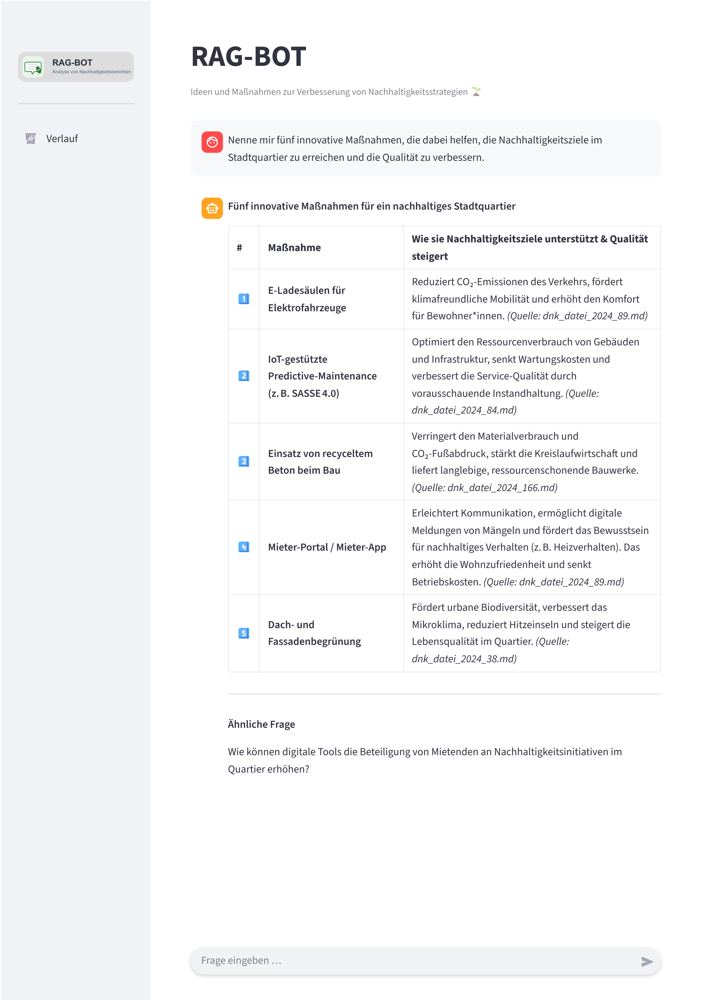
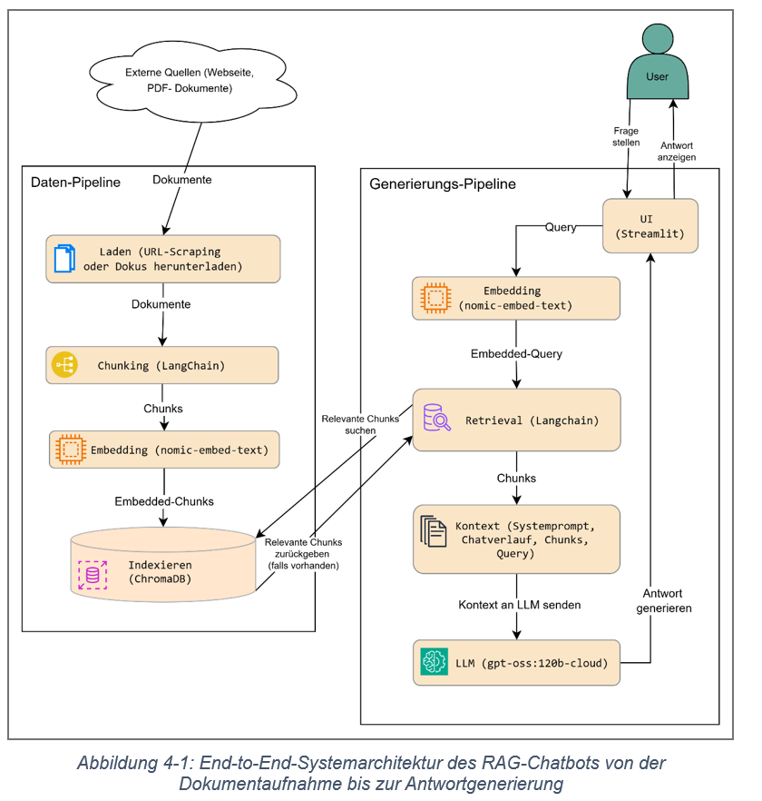

# RAG-Bot für Nachhaltigkeitsberichte


Interaktive Streamlit-Anwendung zur Analyse von Nachhaltigkeitsberichten auf Basis von Retrieval-Augmented Generation (RAG). Die App kombiniert Dokumentenverarbeitung, semantische Suche und eine Chat-Oberfläche mit Quellenbezug.

Das Projekt wurde im Rahmen einer Bachelorarbeit entwickelt und untersucht, wie RAG-Ansätze die Auswertung und Verbesserung von Nachhaltigkeitsberichten unterstützen können.

## Projektziel

Ziel ist es, Nachhaltigkeitsberichte schnell, nachvollziehbar und strukturiert auszuwerten. Die Anwendung soll nicht nur Antworten liefern, sondern den Analyseprozess transparent machen: Welche Quelle wurde verwendet? Welche Informationen sind relevant? Welche nächsten Fragen lohnen sich?

## Funktionsumfang

- Chatbasierte Frage-Antwort-Oberfläche für Nachhaltigkeitsberichte
- Automatische Verarbeitung neuer Dateien im Upload-Ordner
- Dokumentenimport, Extraktion, Chunking und Vektorisierung
- Retrieval mit Kontext aus der lokalen ChromaDB
- Antworten mit Quellenbezug und Markdown-Ausgabe
- Vorschläge für ähnliche Folgefragen
- Logging und Fehlerbehandlung für den laufenden Betrieb
- Klare Trennung von UI, Core-Logik und Hilfsfunktionen

## Screenshots

### Chat-Oberfläche



Die Ansicht zeigt eine typische Frage mit tabellarisch aufbereiteter Antwort, Quellenhinweisen und einem Vorschlag für eine ähnliche Folgefrage.

### Systemarchitektur



Die Grafik zeigt den Ablauf von der Dokumentenverarbeitung über Embeddings und Vektordatenbank bis zur Antwortgenerierung mit Quellenbezug.

## Tech Stack

| Bereich | Technologie |
|---|---|
| Oberfläche | Streamlit |
| Sprache | Python 3.11 |
| RAG / LLM | LangChain, LangChain-Ollama, Ollama |
| Vektor-Datenbank | ChromaDB |
| Dokumentenverarbeitung | pandas, beautifulsoup4, markdownify, markitdown |
| Konfiguration | python-dotenv |
| Automatisierung | watchdog |
| Tests | pytest |

## Projektstruktur

```text
bachelorarbeit-rag-app/
├── core/
├── utils/
├── data/
├── docs/
├── test/
├── main.py
├── automation.py
└── README.md
```

## Voraussetzungen

- Windows oder ein kompatibles Python-Setup
- Python 3.11
- Ollama installiert und gestartet
- Eine `.env`-Datei mit den lokalen Pfaden und Modellnamen
- Die vorbereitete DB-Struktur im Projektordner

## Lokaler Start

### 1) Virtuelle Umgebung erstellen

```bash
python -m venv .venv
.venv\Scripts\activate
```

### 2) Abhängigkeiten installieren

```bash
pip install -r requirements.txt
```

### 3) Datenbasis bereitstellen

Die vorbereitete DB-ZIP-Datei entpacken und den Ordner als `db` im Projektverzeichnis ablegen.

### 4) Ollama-Modelle prüfen

Die genauen Modellnamen stehen in `.env`. Beispiel:

```bash
ollama signin
ollama pull gpt-oss:120b-cloud
ollama pull nomic-embed-text
ollama pull qwen3-embedding:8b
ollama list
```

### 5) App starten

```bash
streamlit run main.py
```


## Hinweise

- Die konkrete Modell- und Pfadkonfiguration wird über `.env` gesteuert.
- Die Anwendung ist für lokale Ausführung und Demonstration ausgelegt.
